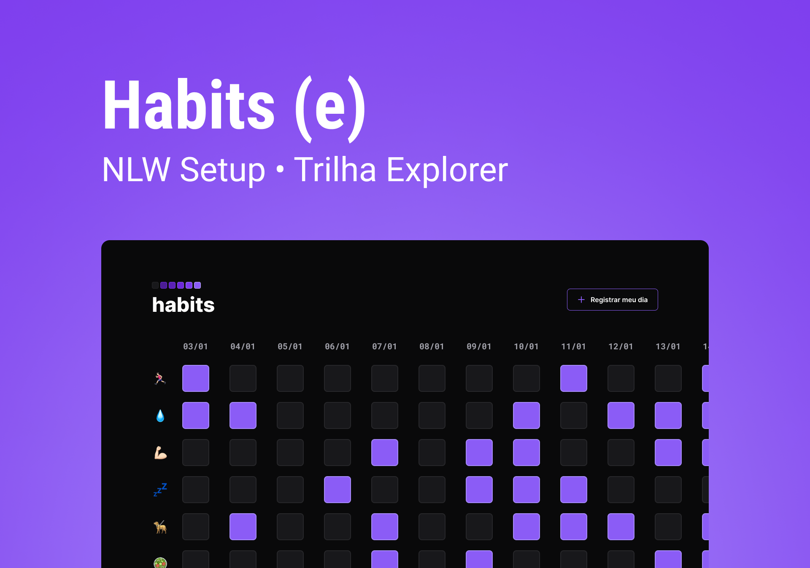

<h1 align="center"> Habits </h1>

NLW is an exclusive and free event, promoted by Rocketseat for teaching WEB technologies, so this project came from this event.  

  <a href="#-technologies">Technologies</a>&nbsp;&nbsp;&nbsp;|&nbsp;&nbsp;&nbsp;
  <a href="#-project">Project</a>&nbsp;&nbsp;&nbsp;|&nbsp;&nbsp;&nbsp;
  <a href="#-layout">Layout</a>&nbsp;&nbsp;&nbsp;|&nbsp;&nbsp;&nbsp;
  <a href="#%EF%B8%8F-license">License</a>

  

 

  

## 🚀 Technologies

This project was developed with the following technologies:

- HTML e CSS
- JavaScript
- Git e Github
- Figma

## 💻 Project

Habits is an app to help track habits.

- [Visit the online project](https://henriquediassilva.github.io/Habits/)

## 🔖 Layout

You can preview the project layout through [THIS LINK](https://www.figma.com/community/file/1195327109778210238). It is necessary to have a [Figma](https://figma.com) account to access it.

## 🖊️ License

This project is licensed under the MIT license

---

Project made with ♥ by Henrique Dias Silva at the Rocketseat event.